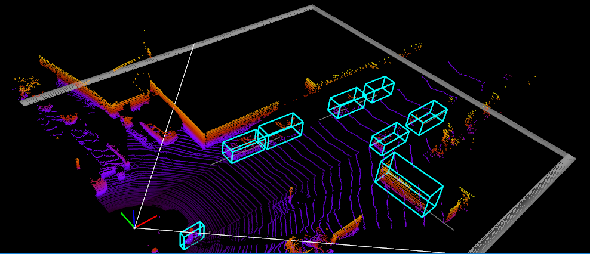
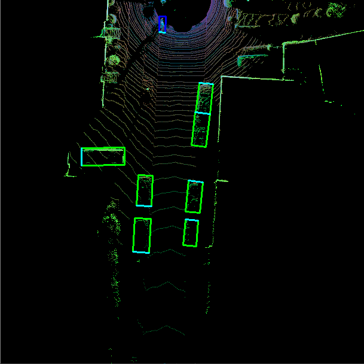
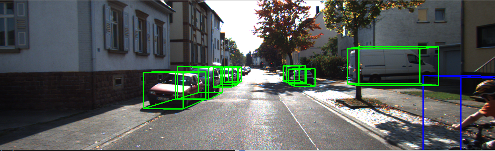

# KITTI Point Cloud Utilities

This repo serves as kitti point cloud dataset utilities. If someone 
is working with kitti point cloud for the first time, this one is going to save a lot of time. 

Thank me later. ^^ 

Following are the main functionality.

1. *Load Point Cloud and filter out points that are not in range of front camera fov*  
2. *Display Point Cloud with object bbox using mayavi library*  
3. *BEV Conversion and display with object bbox using opencv library*  
4. *Project 3D bbox from lidar to camera and camera to lidar box*  

### Installation

**Clone the project and install requirements** 

```rubby
$ git clone https://github.com/ghimiredhikura/KITTI-Point-Cloud-Utils
$ cd KITTI-Point-Cloud-Utils
$ pip install -r requirements.txt
```

### Test

```rubby
$ python load_and_display.py
```

#### Original Point Cloud with object bbox



#### Point Cloud BEV with object bbox



#### Front Left Camera image with object bbox projected from Point Cloud labels


